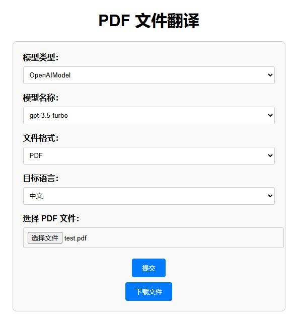

# 使用步骤
1. 配置环境变量OPENAI_API_KEY
2. Python建议使用3.10版本，安装依赖包：`pip install -r requirements.txt`
2. 启动后端接口，在项目根目录（openai-translator）执行：`python  ai_translator/api.py`
3. 浏览器打开 `ai_translator/index.html` 文件
4. 填入参数后提交，翻译完成后点击下载文件

# 新增功能说明
- 使用Flask实现2个API：1.上传并翻译，2.下载文件
- 实现web页面，方便用户操作，页面调用API实现翻译功能
- 支持选择目标语言
- 输出文件格式选择PDF时，会尽量保持原有格式